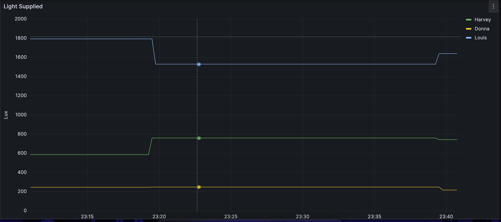
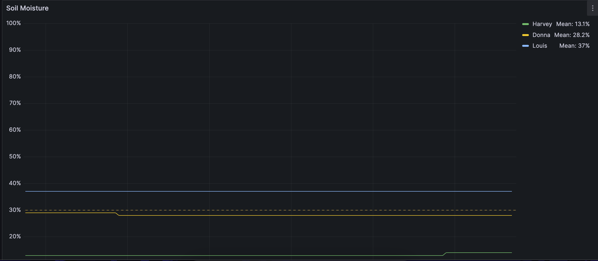
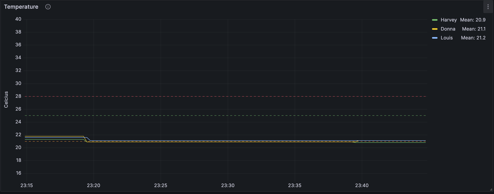
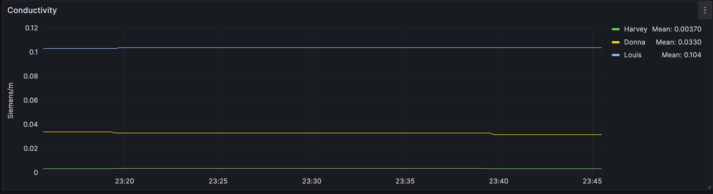
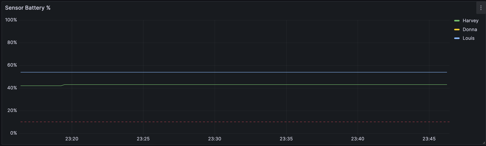

# home-plant-monitoring
(Almost) One-click `docker-compose` full monitoring solution (Prometheus, Alertmanager, and Grafana) for monitoring plant health using https://github.com/xperimental/flowercare-exporter.git with a Raspberry Pi 3 with wifi + bluetooth. Wi-fi and Bluetooth **are** required for the `flowercare-exporter` service to function.

This docker-compose.yml sets up a monitoring stack with Grafana, using Prometheus as a pre-provisioned datasource. The Prometheus stack is also created, along with Alertmanager, pre-configured with a list of rules for plants. You may use this file as a reference when creating your own rules file to create the corresponding alerts based on the flower exporter metrics.

Data is gathered from the bluetooth sensors and retrieved on the Pi, and displayed in a preconfigured dashboard on a web server, right from the device. You may then access this private ip:port from within your home network on any device with a web browser.







+## Hardware
+- [Raspberry Pi (3+)](https://www.raspberrypi.com/products/)
+
+- [Xiaomi MiFlora / HHCC Flower Care devices (up to )](https://www.techpunt.nl/en/xiaomi-mi-flower-care-plant-sensor.html)

## Setup the Pi
1. Install fresh Raspberry Pi OS Lite (64-bit) to Raspberry PI SD card (Raspberry Pi Imager).
2. Hint: To make the rest of these steps easier, click the gear icon in the imager, create a user and add your Wifi Network SSID and password, and SSH public key to the configuration so you can SSH into the Pi from your laptop/computer. Take note of your Pi's private IP address on your home network. (ex. 192.168.XX.YYY) You will need this for setting the IP address in the 'Extra Prometheus Step' section below.

Once the image is complete and the device connects to your wifi network, ssh into the pi:

```
ssh username@<raspi-ip-addr>
```

3. Install docker:
```
sudo apt update
sudo apt install docker.io
```
4. Install docker-compose
```
sudo apt install docker-compose
```
5. You will need a free account at https://hub.docker.com/ to pull containers if you have not already done so.
6. `sudo docker login` and enter your dockerhub credentials. Verify that Login Succeeded.
7. You will need a free account at https://github.com/ to pull repositories if you have not already done so. 
8. Install GitHub CLI
```
sudo apt install gh
```
9. Authenticate with Github.
```
gh auth login
? What account do you want to log into?
> GitHub.com
  GitHub Enterprise Server
? What is your preferred protocol for Git operations?  [Use arrows to move, type to filter]
  HTTPS
> SSH
? Generate a new SSH key to add to your GitHub account?
> Y
? How would you like to authenticate?
> Login with a web browser
  Paste an authentication token
Hit Enter.
```
10. Copy the 8 digit code displayed in the console. If hitting 'Enter' fails to open a browser, copy and paste the link from your terminal into a web browser on your development machine (not the raspberry Pi), and enter the 8 digit code, and click Authenticate.
11. Verify GH access is correct by pulling the home-plant-monitoring repo:
```
gh repo clone rbelair/home-plant-monitoring

Cloning into 'home-plant-monitoring'...
The authenticity of host 'github.com (140.82.112.4)' can't be established.
ED25519 key fingerprint is SHA256:+DiY3wvvV6TuJJhbpZisF/zLDA0zPMSvHdkr4UvCOqU.
This key is not known by any other names.
Are you sure you want to continue connecting (yes/no/[fingerprint])? yes
Warning: Permanently added 'github.com' (ED25519) to the list of known hosts.
remote: Enumerating objects: 5, done.
remote: Counting objects: 100% (5/5), done.
remote: Compressing objects: 100% (5/5), done.
remote: Total 5 (delta 0), reused 0 (delta 0), pack-reused 0
Receiving objects: 100% (5/5), 12.89 KiB | 1.61 MiB/s, done.
```

## Set Environment Variables
On the Raspberry Pi, set the following environment variables to your preferences. The recommended default values for some variables are entered below.

**[SECURITY] DO NOT COMMIT VALUES FOR ENV VARS TO THIS REPO. ONLY CHANGE VALUES OF .env LOCALLY ON THE RASPBERRY PI.**

Scan for the bluetooth devices to obtain their mac addresses, and note them down. You will need them to set the `FLOWERCARE_SENSOR_LIST` environment variable. Replace `device_1|2` with device names of your choosing, and enter the MAC addresses for each device in the format below.

```
ALERTMANAGER_PORT=9093
GMAIL_USER= (optional - see step 'Setup Email Alerting' below)
GMAIL_APP_PASS= (optional - see step 'Setup Email Alerting' below)
GRAFANA_PORT=3000
FLOWERCARE_PORT=9294
FLOWERCARE_REFRESH_DURATION=20m0s
FLOWERCARE_STALE_DURATION=40m0s
FLOWERCARE_SENSOR_LIST="-s device_1=C4:7C:8D:XX:XX:XX -s device_2=C4:7C:8D:XX:XX:XX -s device_3=C4:7C:8D:XX:XX:XX"
PROMETHEUS_PORT=9090
```

**Tip**: From my experience, the default refresh duration for `flowercare-exporter` of 2m0s drains the battery of this particular device very quickly (100% -> 0% in less than 1 week). When setting a refresh duration of 20m0s, it places way less strain on the battery and prolongs the battery life.

## Extra Prometheus Step
You have to set the private IP of the flowercare-exporter service for Prometheus to scrape. Unfortunately, the Prometheus config file doesn't allow environment variable expansion, so you have to set it manually in the config file on the Pi before running `docker-compose`.

In `prometheus/prometheus.yml`, replace the value of `<raspi-private-ip-addr>` with the IP address of the raspberry pi on the network.

## (Optional) Setup Email Alerting
If you would like to set up email alerts via Gmail, you can do so easily by entering your email address as the value of `GMAIL_USER` and a Gmail App Password.

To create a Gmail App Password, see: https://support.google.com/mail/answer/185833?hl=en
Use this value for setting `GMAIL_APP_PASS` in `.env`.

12. You're now ready to set your environment variables and launch the monitoring app! Run the app from within the `home-plant-monitoring` directory:
```
sudo docker-compose up [-d] # Run stack in the background (daemon)
```

- View your Grafana dashboards at [http://raspi-private-ip-addr:3000]()
- View Prometheus at [http://raspi-private-ip-addr:9090]()
- View AlertManager at [http://raspi-private-ip-addr:9093]()
- View flowercare-exporter metrics at [http://raspi-private-ip-addr:9294]()
